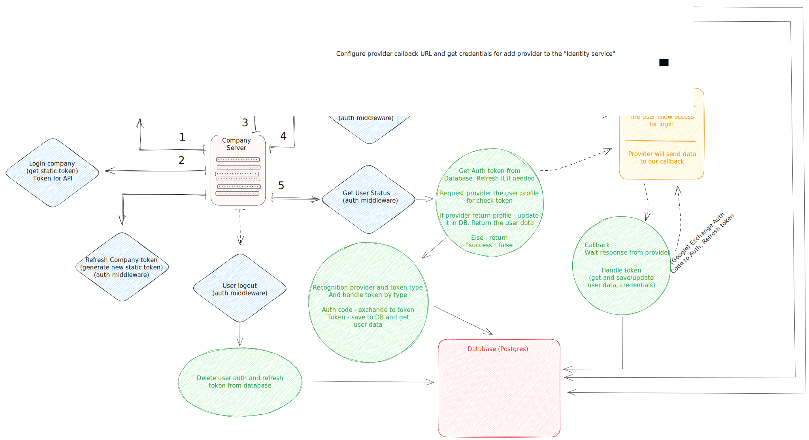

# Identity service

- [Architecture](documentation/Architecture.md)
- [Authorization flow](documentation/Authorization_flow.md)

## Description



The "Identity Service" is a powerful and versatile solution designed to handle the authorization
flow for users within your application. With this service, users can choose their preferred authentication
provider, such as Google, Telegram, or Facebook, during the authorization process.
This flexibility empowers users to use their trusted accounts for a seamless authentication experience.

To integrate the Identity Service into your application, you need to register your application with
the service. Upon successful registration, the Identity Service provides your application with a
static token, which serves as a secure means of communication for authentication requests.

As part of its ongoing development, the Identity Service will soon feature an endpoint to update tokens
for customer applications. This enhancement ensures that your application's authentication process remains
up-to-date and secure, adhering to the latest industry standards.

The authentication flow with the Identity Service is simple and user-friendly. To begin the process,
your application requests a redirect link to the chosen authentication provider,
such as Google or another supported provider. The user is then redirected to the selected
provider's authentication page, where they can log in and grant authorization for your application to access
their account information.

Once the user successfully completes the authentication process, the chosen provider sends the necessary
data back to the Identity Service. To verify the user's authentication status, your application sends
a request to the Identity Service, seeking information about the user's authentication status.

The Identity Service provides convenient endpoints for company registration, user authorization,
and user authentication status checks. Companies can register with the service, enabling them to
interact with the Identity Service and avail of its features. Users can authenticate themselves by providing
their credentials, and upon successful authentication, the Identity Service generates an access token
that allows authorized requests to other services within your application.
External services can also verify a user's authentication status by sending their access token to the
Identity Service. This functionality is vital for implementing access control and managing user sessions
across various applications.

By integrating the Identity Service into your project, you can seamlessly handle the authorization flow
for your users. Its support for multiple authentication providers, user-friendly features,
and upcoming enhancements make it an ideal solution for ensuring secure and efficient user interactions
within your application. Whether you need to authenticate users via Google, Telegram, Facebook, or other providers,
the Identity Service offers a flexible and robust solution to cater to your application's authorization needs.

Identity service can use as on-premises software, and work in customer cloud.
Or the service can be deployed to the cloud and work as SaaS

## Installation

```bash
$ npm install

$ cp .dev.env.example .dev.env

update credentials
```

## Running the app

```bash
# development
$ npm run start

# watch mode
$ npm run start:dev

# production mode
$ npm run start:prod
```

## Test

```bash
# unit tests
$ npm run test

# e2e tests
$ npm run test:e2e

# test coverage
$ npm run test:cov
```

## Development

```bash
# Generate new module
$ nest generate module <module name>

# Generate new controller
$ nest generate controller <controller name>

# Generate new service
$ nest generate service <service name>
```

## License

[GNU licensed](LICENSE).
