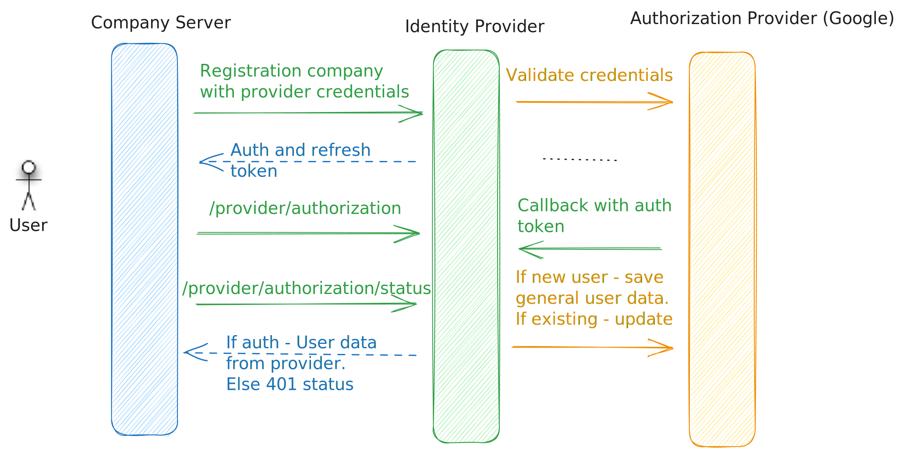

## Architecture service

[Return to main page](../README.md)

## Description

- From company service send a request to "Identity service" `/identity-service/provider/:providerName/authorization`
  it will redirect to the provider auth page. If a company has no provider - will return the status bad request
- When the user will accept authorization - the provider will send to the "Identity service" user data
- When need to check user auth - just send to this service request `/identity-service/user/auth/status`
  If the user has auth data - you will see the data in response. If the user is not authorized - "Identity service"
  will send 401 status

You can authorize the user when a token will expire

