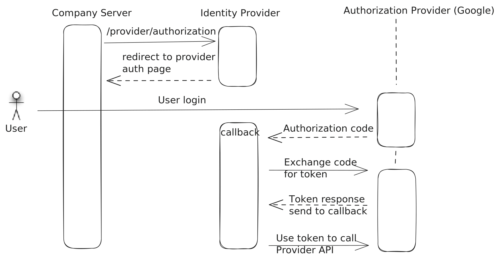

## Authorization flow

[Return to main page](../README.md)

## Description

- From company service sent to the "Identity service" authorized request for authorization a user
  Will create a link, and redirect a request to the provider auth page.
- If the user clicks accept authorization, the provider will send us user data to the callback endpoint
- The identity service will handle these access tokens and will get user data. This means the user is authorized

After the user authorization, you can send a request to the "Identity service" to get user data.
When the token will expire, on a request check a user status - will send 401 status (unauthorized)