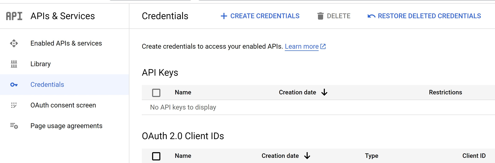

[Return to main page](../../../README.md)

## Setup Google provider

Origin article from Google https://developers.google.com/identity/protocols/oauth2/web-server

#### Create oAuth client
At the first you need to create new oAuth client

- Open https://console.cloud.google.com/apis/credentials

- Click to "Create Credentials", on the top navigation
- In the opened window, choose "Application type" as the Web application
- Name of your oAuth client - as you wish
- Authorized redirect URIs - add URL to the Identity Service callback for Google provider
`https://<host>/identity-provider/provider/callback/google`

#### Create a provider in the Identity Service
When you created an oAuth client from the step "Create oAuth client", you will see the credentials
`client_id`, `client_secret`.

Create a new provider in the Identity Service, with `client_id`, `client_secret` as a config to Google provider
