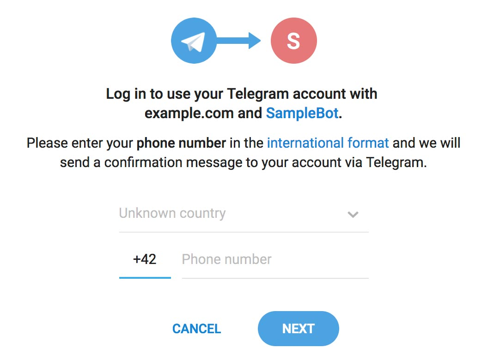

[Return to main page](../../../README.md)

## Setup Telegram provider

Origin article from Telegram https://core.telegram.org/widgets/login
But you don't need a widget using the Identity Service

#### Setting up a bot
To use the login widget, you'll need a Telegram bot.

We strongly recommend that the profile picture of the bot you use for authorization corresponds with your website‘s logo, and that the bot’s name reflects that connection.

Users will see this message when they log into your website:

It is more likely that users will log in if your bot has a name and logo they expect to see.

#### Linking your domain to the bot
Once you have chosen a bot, send the /setdomain command to @Botfather to link identity-provider-service host.
Like https://identity-provider-specialapp.com

#### Create a provider in the Identity Service
Here need a bot token from the first step. When you created bot in @BotFather you saw
"Use this token to access the HTTP API". Example `671739097:AAEhz0eVn4cYWBy`

Create new a provider in the Identity Service, with a bot token as a config to Telegram provider

